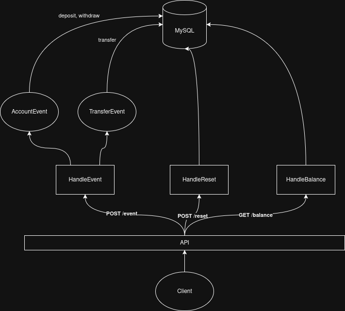

# ebanx-api
Implementação de uma API simples utilizando FastAPI (Python) e Swagger para o teste técnico da empresa EBANX
 

# Introdução

Esta API fornece operações básicas de gestão de contas e transações financeiras, permitindo a criação de contas, depósitos, saques e transferências entre contas. Além disso, oferece um mecanismo para consultar saldos e reiniciar o estado da aplicação.  

Os principais pontos da API são:  

- **Reset do estado**: possibilita reiniciar todos os dados antes de iniciar os testes.  
- **Consulta de saldo (`/balance`)**: retorna o saldo de uma conta existente ou erro caso a conta não exista.  
- **Eventos (`/event`)**: permite registrar operações financeiras, como:  
  - **Depósito**: cria uma conta com saldo inicial ou adiciona valor a uma conta existente.  
  - **Saque**: retira valor de uma conta existente.  
  - **Transferência**: move valor entre contas.  

 

# Visão Geral dos Endpoints

| Método | Rota        | Descrição                                                                 |
|--------|-------------|---------------------------------------------------------------------------|
| POST   | `/reset`    | Reinicia o estado da aplicação, apagando todas as contas e transações.    |
| GET    | `/balance`  | Consulta o saldo de uma conta existente pelo `account_id`.                |
| POST   | `/event`    | Registra um evento financeiro. Pode ser: depósito, saque ou transferência.|

 

# Visao Geral das Classes (Pydantic)

- `Account <- {id}`

- `WithdrawEvent <- {origin, amount}`

- `TransferEvent <- {origin, amount, destination}`

 
 

